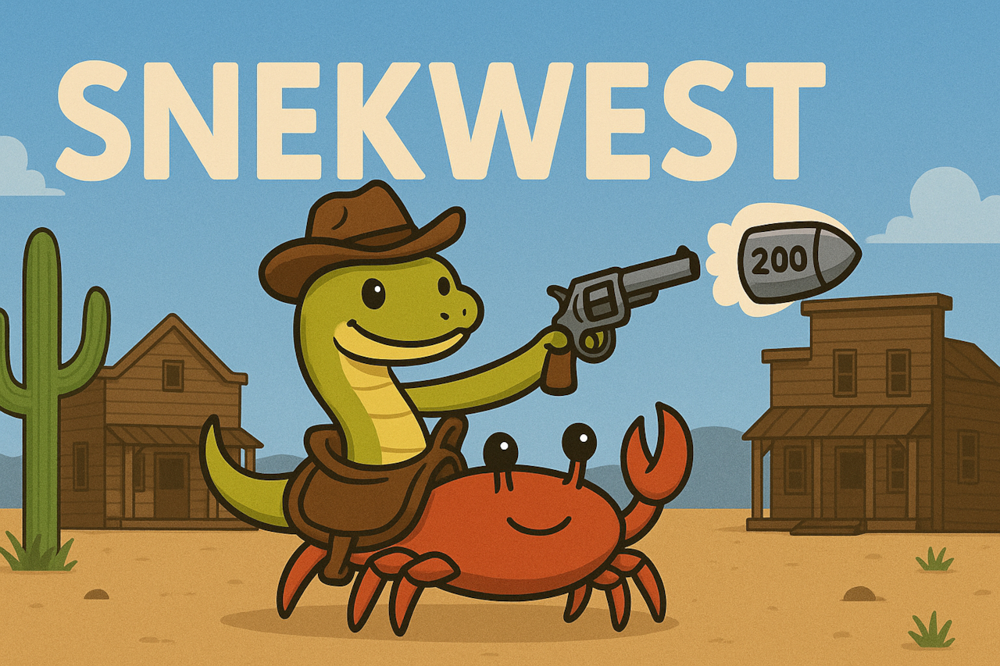

# 🐍 Snekwest

**A blazingly fast, memory-safe HTTP client ecosystem for Python, powered by Rust’s [`reqwest`](https://docs.rs/reqwest/).**

Snekwest is a modern rewrite of Python's beloved [`requests`](https://docs.python-requests.org/en/latest/), powered by Rust for performance, safety, and future-proof concurrency. It starts as a drop-in replacement for `requests`, Snekwest expands to cover [`aiohttp`](https://docs.aiohttp.org/en/stable/) and Python's free-threaded mode [free-threaded mode](https://docs.python.org/3.12/whatsnew/3.12.html#free-threaded-cpython).

---

## 🚀 Features

- 🐍 **Drop-in compatibility with `requests`**: `import snekwest as requests`
- ⚡ **Backed by Rust's `reqwest`** for speed, security, and low memory usage
- 🧵 Roadmap includes full async support and free-threaded Python
- 📦 Easy to install using [`uv`](https://github.com/astral-sh/uv) or `pip`

---


## 📦 Installation

### ✅ Recommended: With [uv](https://github.com/astral-sh/uv)

```bash
uv add snekwest
```

### 🐍 With pip

```bash
pip install snekwest
```

## 🧪 Usage: Drop-in Replacement

Snekwest mirrors `requests`' API, so you can use it as a direct substitute:

```python
import snekwest as requests

response = requests.get("https://example.com")
print(response.status_code)
print(response.text)
```

Using sessions:

```python
from snekwest import Session

with Session() as session:
    response = session.get("https://example.com")
    print(response.json())
```

## 🗺️ Roadmap & Versioning

Snekwest follows a structured milestone versioning strategy inspired by semantic versioning:

| Milestone | Target Version | Description |
|-----------|----------------|-------------|
| 🚀 Minimal `requests` support | 0.1.0 | Basic GET support, core structure in place |
| ✅ Full `requests` compatibility | 0.3.3 | Complete sync API, tested drop-in replacement |
| ⚙️ Full `aiohttp`-style async API | 0.6.6 | Async support with parity to `aiohttp` |
| 🚀 Free-threaded Python support | 1.0.0 | Full ecosystem ready for production use |

> Before `1.0.0`, expect breaking changes between minor versions.

Milestones give users and contributors a clear sense of project direction and maturity.